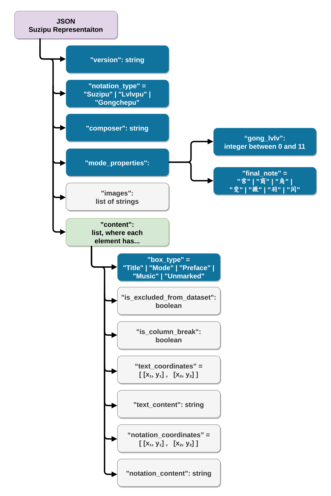

# gui-tools  
Collection of tools with the purpose of digitally storing and editing suzipu music notations or annotations.

## Preparing the Environment

1. Make sure that `Python 3.10` is installed with the `tkinter` library. Under Windows `tkinter` should be
provided by default. See also: [Ubuntu install](https://www.pythonguis.com/installation/install-tkinter-linux/),
[MacOS install](https://www.pythonguis.com/installation/install-tkinter-mac/).
2. Install the requirements from [requirements.txt](requirements.txt) using `pip`. This may be platform dependent, e.g.,
   under Ubuntu this can be achieved with the command `python3 -m pip install -r requirements.txt`.

## How to Cite

Please cite the software using the paper
[The Suzipu Musical Annotation Tool for the Creation of Machine-Readable Datasets of Ancient Chinese Music](https://link-to-paper.example.com](https://repositum.tuwien.at/bitstream/20.500.12708/190035/1/Calvo-Zaragoza-2023-Proceedings%20of%20the%205th%20International%20Workshop%20on%20Read...-vor.pdf)
where the annotation tool was presented the first time:

```
@InProceedings{Repolusk2023,
  author    = {Repolusk, Tristan and Veas, Eduardo},
  booktitle = {Proceedings of the 5th International Workshop on Reading Music Systems},
  title     = {The Suzipu Musical Annotation Tool for the Creation of Machine-Readable Datasets of Ancient Chinese Music},
  year      = {2023},
  address   = {Milan, Italy},
  editor    = {Calvo-Zaragoza, Jorge and Pacha, Alexander and Shatri, Elona},
  pages     = {7--11},
  file      = {:2023 - The Suzipu Musical Annotation Tool for the Creation of Machine Readable Datasets of Ancient Chinese Music.pdf:PDF},
  url       = {https://sites.google.com/view/worms2023/proceedings},
}
```

## List of Tools

Currently, this repository consists of the following tools:

1. The JSON schema `json_schema.json` which can be used to verify that corpus files are of valid structure. To get
   additional information about the digital representation format described by the schema, please refer to the figure
   below and chapter `IV. Methods A. Digital Representation` of the original paper. 


   


2. ***Suzipu*** **Musical Annotation Tool**: Given a collection of images containing *suzipu* notation,
	this tools provides everything needed to annotate the images with segmentation boxes and notation
	information. This is the tool you need for creating datasets for use in OMR (optical music recognition)
	projects.
 
	[See the tutorial for the Suzipu Musical Annotation Tool](readme_files/README_ANNOTATION_TOOL.md)
	
	

