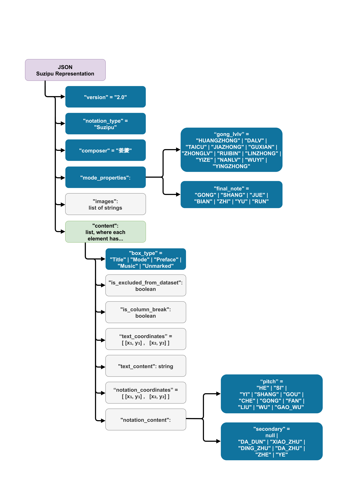

# gui-tools  
Collection of tools with the purpose of digitally storing and editing suzipu music notations or annotations.

## Preparing the Environment

1. Make sure that `Python 3.10` is installed with the `tkinter` library. Under Windows `tkinter` should be
provided by default. See also: [Ubuntu install](https://www.pythonguis.com/installation/install-tkinter-linux/),
[MacOS install](https://www.pythonguis.com/installation/install-tkinter-mac/).
2. Install the requirements from [requirements.txt](requirements.txt) using `pip`. This may be platform dependent, e.g.,
   under Ubuntu this can be achieved with the command `python3 -m pip install -r requirements.txt`.

## How to Cite

Please cite the software using the paper
[The Suzipu Musical Annotation Tool for the Creation of Machine-Readable Datasets of Ancient Chinese Music](https://repositum.tuwien.at/bitstream/20.500.12708/190035/1/Calvo-Zaragoza-2023-Proceedings%20of%20the%205th%20International%20Workshop%20on%20Read...-vor.pdf)
where the annotation tool was presented the first time:

```
@InProceedings{Repolusk2023,
  author    = {Repolusk, Tristan and Veas, Eduardo},
  booktitle = {Proceedings of the 5th International Workshop on Reading Music Systems},
  title     = {The Suzipu Musical Annotation Tool for the Creation of Machine-Readable Datasets of Ancient Chinese Music},
  year      = {2023},
  address   = {Milan, Italy},
  editor    = {Calvo-Zaragoza, Jorge and Pacha, Alexander and Shatri, Elona},
  pages     = {7--11},
  file      = {:2023 - The Suzipu Musical Annotation Tool for the Creation of Machine Readable Datasets of Ancient Chinese Music.pdf:PDF},
  url       = {https://sites.google.com/view/worms2023/proceedings},
}
```

## List of Tools

For a detailed technical documentation of the digital representation formats and the tools, please refer to
[the chapter of my dissertation](readme_files/documentation.pdf).

Currently, this repository consists of the following components:

1. The JSON schema `json_schema.json` which can be used to verify that corpus files are of valid structure. It has additional
   subschemata `json_schema_suzipu.json`, `json_schema_lvlvpu.json`, `json_schema_jianzipu.json` for the individual notations.
   The *suzipu* schema is illustrated in the figure below:


   


2. **Chinese Musical Notation Annotation Tool**: Given a collection of images containing *suzipu*/*lülüpu*/*jianzipu* notation,
	this tools provides everything needed to annotate the images with segmentation boxes and notation
	information. This is the tool you need for creating datasets for use in OMR (optical music recognition)
	projects.

	[1. See the tutorial for the Chinese Musical Notation Annotation Tool](readme_files/annotation_tool_tutorial.pdf)
    
    [2. Export the files using the export script](readme_files/extract_dataset_from_corpus.md)

	

3. **Chinese Musical Notation Editor**: This tool is for creating purely symbolic representations of scores containing
   *suzipu*/*lülüpu*/*jianzipu* notation. Use this when the purely symbolic contents of the pieces suffice, i.e.,
   whenever no linking to image data is needed.
 
	[See the tutorial for the Chinese Musical Notation Editor](readme_files/notation_editor_tutorial.pdf)
	
	


## Preparing the Environment

**NOTE: Due to conflicts between `tkinter` and `OpenCV`, the tools are currently not executable on Windows.
MacOS also seems to be not supported. The application was developed and tested on Ubuntu 24.04.3.**

1. Make sure that `Python 3.10` is installed with the `tkinter` library. Under Windows `tkinter` should be
provided by default. See also: [Ubuntu install](https://www.pythonguis.com/installation/install-tkinter-linux/),
[MacOS install](https://www.pythonguis.com/installation/install-tkinter-mac/).
2. Install the requirements from [requirements.txt](requirements.txt) using `pip`. This may be platform dependent, e.g.,
   under Ubuntu this can be achieved with the command `python3 -m pip install -r requirements.txt`.
3. In order to use the annotation tool, the segmentation algorithm's weight file `HRCenterNet.pth.tar` must
   be downloaded:
   [See the links provided in HRCenterNet's README](https://github.com/Tverous/HRCenterNet#download-the-dataset-and-the-pretrained-weight).
4. Furthermore, the downloaded weight file `HRCenterNet.pth.tar` must be moved to the folder `weights` in the repository's
   root folder.
5. For using the text-based `Intelligent Fill...` function, the file `chi_tra.traineddata` for `tesseract` must be
   present in the folder `weights` in the repository's root folder. For best results, use Wang Dingyun's trained model
   from [this site](https://github.com/gumblex/tessdata_chi/releases/tag/v20220621).


For starting the annotation tool, follow these steps:
1. Change the console directory to the root of the git repository.
2. Start the annotation tool by executing the file `annotation_editor.py`. This is usually done using one
   of these commands: `python3 annotation_editor.py` or `python annotation_editor`.
