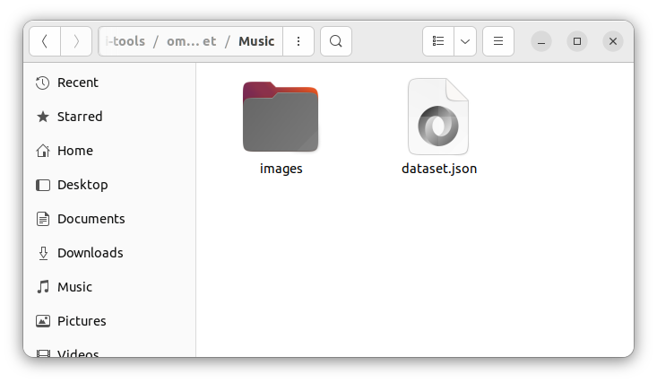

### Extract OMR Dataset from Corpus

In order to extract an OMR dataset from the corpus, the file `extract_dataset_from_corpus.py` must be used. It is in the
repository's root folder, and should be executed using the following syntax:

```
usage: extract_dataset_from_corpus.py [-h] --corpus_dir CORPUS_DIR --output_dir
                                      OUTPUT_DIR

Suzipu Annotated OMR Dataset Export Script.

options:
  -h, --help            show this help message and exit
  --corpus_dir CORPUS_DIR
                        Path to the folder which contains the corpus files (JSON
                        format). The folder is checked recursively for any JSON
                        files placed inside this folder or subfolders.
  --output_dir OUTPUT_DIR
                        Path to the output folder to which the dataset is saved. If
                        it doesn't exist, the script will try to create the folder.
```

In our example, let's try to execute it with the corpus directory `--corpus_dir ./tutorial` and the output directory
`--output_dir ./omr_dataset`. The folder `omr_dataset` is created, and the contents are two subfolders:


In folder `Music`, the image data associated with notation boxes is saved, while  folder `Text` contains the text-based
image data (i.e., title, mode, preface or lyrics) is saved.



In each folder is a folder `images` and a `dataset.json`, ...


... which is a list of all files in this subfolder, with the file names indexed in field `file_name`, the original
segmentation box type stored in field `type`, and the annotation string contained in field `annotation`.


In the subfolder `images`, the extracted images are contained.
